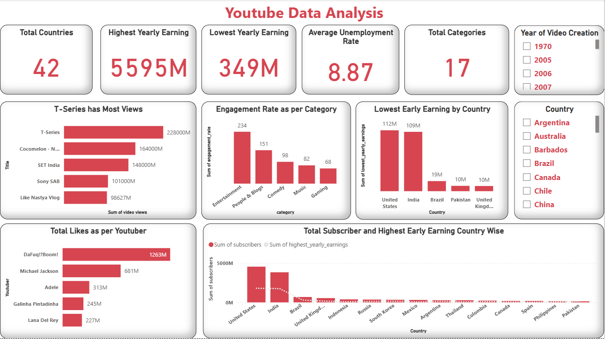

# 📺 YouTube Data Analysis Dashboard | Power BI

This project features a Power BI dashboard that analyzes global YouTube data, uncovering trends in views, subscribers, earnings, engagement rates, and channel categories. It offers insights into top-performing creators and helps understand digital content trends across countries.

---

## 📁 Files

- `YouTube Dashboard.pbix` — Power BI dashboard file  
- `images/youtube-dashboard-screenshot.png` — Dashboard preview image

---

## 🎯 Objective

To explore and visualize YouTube channel performance across the globe using real-world data and answer key business questions:

- Which channels have the highest views and subscribers?
- Which countries dominate in YouTube content creation and earnings?
- How do earnings correlate with subscribers and engagement?
- What categories perform best in terms of views and audience interaction?
- Is there a trend between unemployment rate and YouTube channel growth?

---

## 📊 Key Insights

### 🌍 Global Distribution
- **Data spans 42 countries** and **17+ categories**.
- The **USA** and **India** lead in terms of channel count, subscribers, and revenue.

### 🔝 Most Viewed Channel
- **T-Series** tops the list with **228B+ views**, followed by **Cocomelon**, **SET India**, and **Sony SAB**.

### 💰 Earnings Overview
- **Highest yearly earnings**: `$5595M`
- **Lowest yearly earnings**: `$349M`
- Countries like **India** and the **USA** dominate both top and bottom tiers, indicating diverse creator economies.

### 📈 Engagement Metrics
- **Entertainment** and **People & Blogs** categories record the **highest engagement rates**.
- **DaFuq!?Boom!** has the **highest average likes per video**, exceeding **1.26B**.
  
### 💬 Socioeconomic Context
- The **average unemployment rate** across YouTube-rich countries is **8.87%**, providing insight into creator motivations.

---

## 🎨 Dashboard Design

- **Color Theme**: YouTube’s signature **red and white** for brand consistency.
- **Key Visuals**:
  - **Bar Charts**: Top channels by views, likes, earnings
  - **Combo Chart**: Subscribers vs. yearly earnings
  - **KPI Cards**: Total channels, subscribers, earnings, unemployment rate
  - **Slicers**: Country, Category, Channel Type

---

## 🧰 Tools Used

- **Power BI Desktop**
- **Power Query** for data transformation
- **YouTube Creator Dataset** (with metrics: views, subscribers, earnings, engagement, etc.)

---

## 🖼️ Dashboard Preview

> Interactive visualizations for exploring YouTube content trends globally.

---

## 👨‍💻 Author

**Atharv Shete**  
📧 sheteatharv1609@gmail.com  
🔗 [GitHub: AtharvShete2610](https://github.com/AtharvShete2610)

---

⭐ *Found this dashboard insightful? Leave a ⭐ on the repo and share it with others!*
